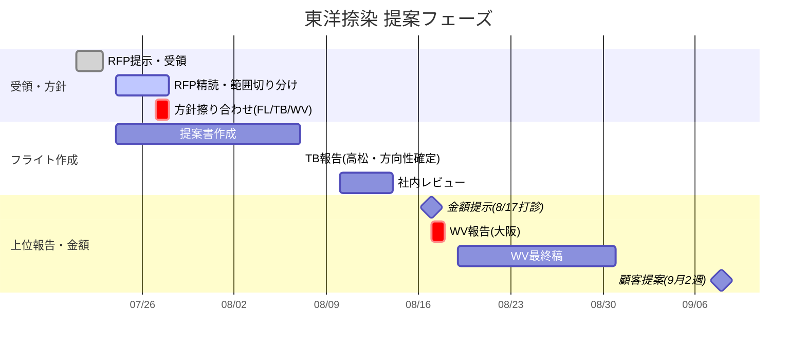

# 東洋捺染｜提案〜金額提示スケジュール

> 最終更新: 2026-07-23  
> フェーズ: RFP受領〜提案（受注前）  
> ステータス: 日程・会場は**社内調整中**の項目あり

---

## 1. 商流（誰が誰に出すか）

```
東洋捺染（発注側）
    ↑ 提案
ワークビジョン
    ↑ 提案内容の報告・擦り合わせ
トスバック
    ↑ 提案・見積の実務
フライト
```

| レイヤ | 役割（このフェーズ） |
|--------|----------------------|
| **ワークビジョン** | 元請・顧客窓口。最終提案書の取りまとめ・提示 |
| **トスバック** | 中間。フライト提案の受け・社長／会長レビュー |
| **フライト** | RFP読込、担当範囲整理、提案方針・提案書作成 |

金額提示の希望日は顧客側 **8/4** → 現実的でないため **8/17** で打診中。

---

## 2. タイムライン（一目用）

| 時期 | 何をするか | 出席・関与 | 場所・形式 | 状態 |
|------|------------|------------|------------|------|
| **7/21〜23** | RFP提示・受領 | WV / TB / FL | — | 実施中〜完了想定 |
| **7/24〜** | RFP精読、担当範囲の切り分け案 | **フライト中心** | 社内 | 要着手 |
| **7/27〜28** | 提案方針の擦り合わせ | **FL × TB × WV** | Web想定 | 要設定 |
| **7/24〜8/7** | 提案書作成 | フライト（現状想定2名） | 社内 | **人数含む社内調整** |
| **8/6 or 8/7** | 提案内容の報告 | **FL × TB**（社長・会長） | **高松希望** | 川手→**8/7希望**。会場・出席の社内調整 |
| ※ここまで | **提案の方向性を確定**しておく | — | — | デッドライン |
| **8/10〜14** | フライト社内レビュー完了 | フライト | 社内 | 必須 |
| **8/17** | 金額提示（打診中の希望日） | （商流経由） | — | **8/4は不可→8/17打診** |
| **8/17 or 8/18** | 提案内容の報告 | **WV × TB × FL** | **大阪訪問希望** | 社内調整必要 |
| **8/19〜31** | 提案書最終稿作成・提示 | **ワークビジョン中心**（FL/TB協力） | — | — |
| **9月2週目** | 顧客への提案 | WV（＋必要ならTB/FL） | — | — |



---

## 3. 関わる人

| 組織 | 人・ロール | このフェーズでの関与 |
|------|------------|----------------------|
| **フライト** | 川手 | 提案リード。TB報告は **8/7希望** と回答済み |
| **フライト** | 提案作成メンバー（現状想定2名 ※佐久間等・要確定） | 7/24〜8/7 提案書作成。**2名で足りるか社内調整** |
| **フライト** | 社内レビュアー（要アサイン） | 8/10〜14 レビュー |
| **トスバック** | 社長・会長 | 8/6〜7 報告会出席予定。**高松開催希望** |
| **トスバック** | 実務窓口（要確認） | 方針擦り合わせ・報告の連絡 |
| **ワークビジョン** | 提案取りまとめ側（要確認） | 7/27〜28 方針合わせ、8/17〜18 大阪報告、8/19〜最終稿 |
| **東洋捺染** | 発注側 | RFP提示、金額希望、9月提案の受け手 |

略称: FL＝フライト / TB＝トスバック / WV＝ワークビジョン

---

## 4. タスク一覧（誰が・何を・いつまで）

### A. 今すぐ（〜7/28）

| # | タスク | 主担当 | 期限目安 | 成果物 |
|---|--------|--------|----------|--------|
| A1 | RFP通読・論点洗い出し | フライト | 7/24〜26 | 論点リスト |
| A2 | **担当範囲の切り分け案**（後述） | フライト → TB/WVと合意 | **7/27〜28の打合せまで** | 責任分界表 |
| A3 | 提案方針の擦り合わせ打合せ設定 | TB/WV/FL | **7/27〜28** | Web会議 |
| A4 | 提案作成の人員確認（2名で足りるか） | フライト社内 | 7/24前後 | 体制決定 |

### B. 提案作成〜TB報告（7/24〜8/7）

| # | タスク | 主担当 | 期限目安 | 成果物 |
|---|--------|--------|----------|--------|
| B1 | 提案書ドラフト作成 | フライト | **8/7まで** | 提案書v0.x |
| B2 | 8/6・8/7の日程・会場確定（高松） | TB×FL（川手8/7希望） | 早め | 開催確定 |
| B3 | TB向け提案内容報告 | フライト → トスバック | **8/6 or 8/7** | 方向性合意 |
| B4 | ※報告時点で**提案の方向性は確定** | 三者合意ベース | **8/7** | Go判断 |

### C. 社内レビュー〜WV報告・金額（8/10〜18）

| # | タスク | 主担当 | 期限目安 | 成果物 |
|---|--------|--------|----------|--------|
| C1 | フライト社内レビュー | フライト | **8/10〜14** | 提案書v1（レビュー済） |
| C2 | 金額提示（顧客希望8/4は不可 → **8/17打診**） | 商流に沿い提示 | **8/17** | 概算／見積方針 |
| C3 | WV×TB×FL 大阪訪問・提案内容報告 | 三者 | **8/17 or 8/18** | WV合意 |

### D. 最終稿〜顧客提案（8/19〜9月）

| # | タスク | 主担当 | 期限目安 | 成果物 |
|---|--------|--------|----------|--------|
| D1 | 提案書最終稿作成 | **ワークビジョン**（FL/TB協力） | **8/19〜31** | 最終提案書 |
| D2 | 顧客への提案 | WV中心 | **9月2週目** | 提案実施 |

---

## 5. 提案範囲の切り分け（RFP精読後に決めること）

今回 **WMSも提案範囲**。RFPを読んだうえで、フライトが担う／他社・他領域に任せるを調整する。

| 領域 | 想定 | フライト | 他（WV/TB/外部等） | メモ |
|------|------|----------|-------------------|------|
| B2B EC／受発注 | 本業寄り | ● 主担当候補 | 要確認 | 従来スコープに近い |
| **WMS** | **今回スコープ入り** | どこまでやるか要判断 | 連携・主担当の切り出し候補 | RFPの要求深度次第 |
| デジタルマーケティング | RFPに含まれる可能性 | △ 支援／外し | ● 任せ候補 | 方針擦り合わせで確定 |
| その他RFP項目 | 精読後に分解 | 要仕訳 | 要仕訳 | A2の成果物に落とす |

→ **7/27〜28の三者打合せ前に、フライト内で「やる／やらない／要相談」のたたきを用意する。**

---

## 6. 社内調整が必要な論点（チェックリスト）

- [ ] **金額提示日**: 顧客8/4希望 → **8/17で打診中**（確定したら表を更新）
- [ ] **7/27〜28** FL×TB×WV 方針擦り合わせ（Web？）の日程確定
- [ ] **8/6 or 8/7** TB報告: 川手は**8/7希望**。社長・会長出席・**高松**希望 → フライト側の出張・体制
- [ ] **提案書作成が2名で足りるか**（7/24〜8/7）
- [ ] **8/17 or 8/18** 大阪訪問（WV報告）のフライト出席者
- [ ] WMS／デジマケ等の**責任分界**（RFP読後）
- [ ] 社内レビュアーのアサイン（8/10〜14）

---

## 7. クリティカルパス（遅れ不可）

```
RFP精読・範囲案
  → 7/27-28 方針擦り合わせ
    → 8/7 TB報告で方向性確定
      → 8/10-14 社内レビュー
        → 8/17-18 WV報告（＋金額8/17打診）
          → 8/19-31 WV最終稿
            → 9月2週 顧客提案
```

**一番危ないのは「8/7までに方向性が固まっていない」こと。**  
作成期間（〜8/7）とTB報告が同じ週に重なるため、方針擦り合わせ（7/27〜28）を前倒しで確定させる。

---

## 変更履歴

| 日付 | 内容 |
|------|------|
| 2026-07-23 | 初版（商流・日程・関与者・タスク・切り分け論点） |
